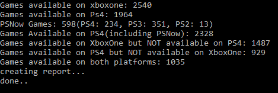

大家知道XboxOne和PS4上分别能玩到多少游戏吗，这个小工具帮助统计平台游戏数据，顺带导出游戏名称列表。
这对于买Xboxone还是买PS4，可以有一定参考作用。

## 结论
截至现在(2019/04/25)
* Xboxone上1952个原生平台游戏，另外还能玩到来自Xbox360的555个兼容游戏，以及33个来自初代Xboxone的兼容游戏，合计1952+555+33=2540个。能在Xbxone/XboxOne S/ Xboxone X上能玩到的游戏列表：[library-04-25-2019.xlsx](GameCounter/library-04-25-2019.xlsx)
* PS4上由于没有兼容游戏，所以就直接是原生平台游戏1964个。能在PS4/PS4 Pro上玩到的游戏列表：[library-04-25-2019.xlsx](GameCounter/library-04-25-2019.xlsx)
* 能在Xboxone上能玩到的游戏，但无法在PS4上玩到的游戏共有 1487 个，完整列表：[microsoft_exclusive.xlsx](GameCounter/microsoft_exclusive.xlsx)
* 能在PS4上玩到，但无法在Xboxone上玩到的游戏，共有929个，完整列表： [PS4_exclusive.xlsx](GameCounter/PS4_exclusive.xlsx)
* 两个平台都能玩到的游戏共有1035个。完整列表：[PS4_Xboxone.xlsx](GameCounter/PS4_Xboxone.xlsx)
* 经提醒，PS Now虽然会出现较严重的卡顿，但毕竟也提供了一个可能性，至少能有部分人能够通过这个途径玩到上代Play Station的游戏。所以在PS4游戏库基础上再包含PS Now的游戏，则能在PS4玩到2328款游戏。  

## 声明：
### 数据来源为维基百科的统计列表，网址分别为：

XboxOne游戏数据来源：  
https://en.wikipedia.org/wiki/List_of_Xbox_One_games

Xboxone上的兼容游戏数据来源：  
https://en.wikipedia.org/wiki/List_of_backward_compatible_games_for_Xbox_One

PS 4 游戏数据来源：  
https://en.wikipedia.org/wiki/List_of_PlayStation_4_games  
https://en.wikipedia.org/wiki/List_of_PlayStation_4_games_(M-Z)  
https://en.wikipedia.org/wiki/List_of_PlayStation_4_free-to-play_games  
PS Now 游戏数据来源：  
https://en.wikipedia.org/wiki/List_of_PlayStation_Now_games

> 维基的这些数据被导入了[excel](GameCounter/library-04-25-2019.xlsx)中，所以原网址更新，excel不会自动更新，需要手动维护这个excel.

#### 为什么不使用直接商店的数据呢？
如果要使用商店数据，首先得写爬虫去爬下来所有的游戏列表；其次由于地域差别，部分游戏在部分地区不上架，这回导致爬虫需要爬很多地区的商品，然后汇总。

另外，商店内的数据有各种占位，比如刺客信条奥德赛就分为标准版，黄金版，终极版，还有季票，各类DLC，各类氪金，这些不能算是游戏，只是奥德赛的附加内容，只能计算一次，其次还有各种捆绑包，DEMO等等，重复内容太多，区分难度大，故此使用现成的列表。

#### 统计结果跟维基百科页面的显示上有1或2的差别
这个问题我目前我尚未找出问题哪。维基百科上显示xboxone和ps4上的游戏数量为1965和1954，但我程序只数出了1964和1952个，有细微差别，尚未去查明原因。

### 独占数据并不是严格独占
目前生成独占数据含有PC上也发布的内容。例如，在 [microsoft_exclusive.xlsx](GameCounter/microsoft_exclusive.xlsx)中，战争机器4是PC/Xbxone都可以玩的，但PS4上没有，所以出现在exclusive列表中，命名也改成microsoft exclusive而不是xboxone exclusive.

在[PS4_exclusive.xlsx](GameCounter/PS4_exclusive.xlsx)中，也包含登陆PC的内容，比如Nioh	(Sony Interactive Ent)，即仁王，这个PC上也有，但仍然算作PS4独占。
所以这个独占列表不严谨，生成这个列表的目的是为了列出这两类内容：
* 在xboxone上能玩到的游戏，但PS4上玩不到（无视PC）
* 在PS4上能玩到的游戏，但Xboxone上玩不到(无视PC)